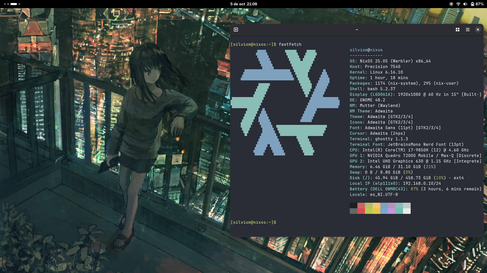

<h1> Hola, estoy usando NixOS con entorno de escritorio <strong>Gnome</strong></h1>
<pre>Aqui una foto de como se mira</pre>

<h1> Al final termine usando Hyrpland</h1>
<pre> Se miraba muy bien y todo funcionaba bien, sin embargo quise probar nuevas distros.
      Actualmente estoy usando EndeavourOS y Arch-Linux sin embargo pienso cambiar Endeavour por Debian 12 
      Por que Debian funciona de maravilla
</pre>
